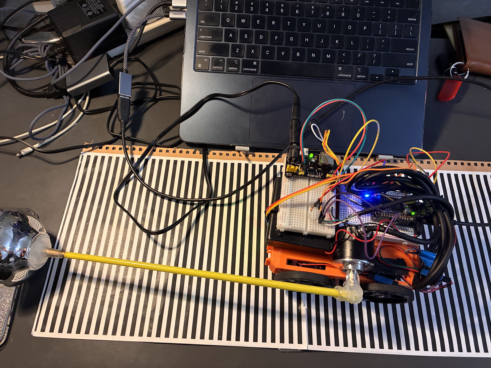
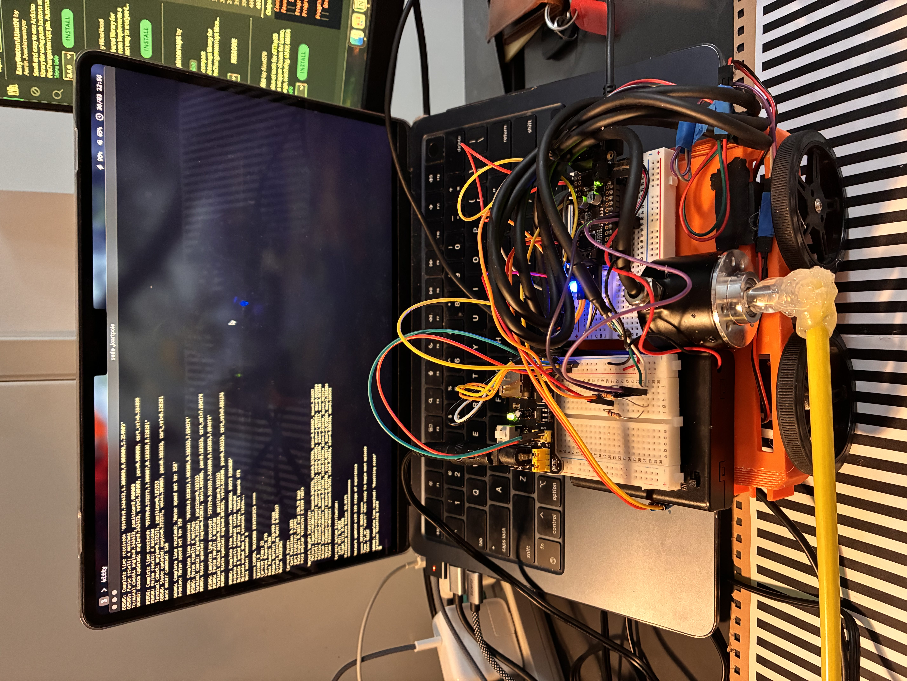
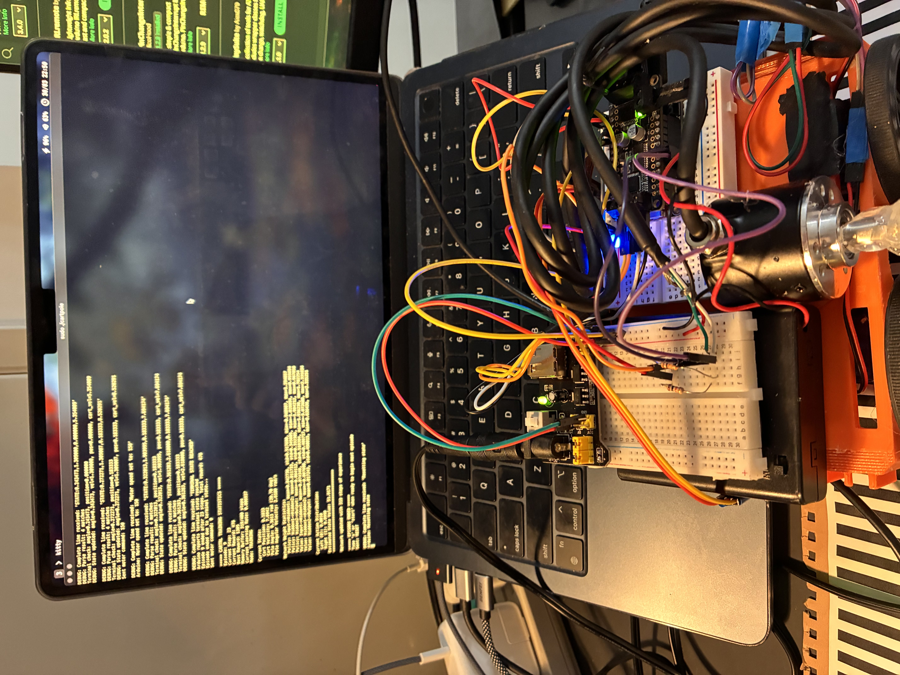

# Cart-Pole Control System Overview

## Arduino Firmware

The Arduino firmware manages a physical cart-pole system using sensors and motors. It's responsible for real-time monitoring and actuation while communicating with a host computer.

### Key Components

- Hardware control for motors using Adafruit Motor Shield
- Rotary encoder processing for pole angle measurement
- IR sensor-based position tracking with black/white stripe detection
- Real-time state variable updates including pole angle, angular velocity, cart position, and velocity
- Serial communication protocol with configurable command system
- Terminal state detection based on angle and position limits
- I2C health monitoring with automatic recovery

The firmware runs the main control loop at 50Hz (20ms intervals), providing consistent state updates and responding to commands from the host system. It implements debouncing for encoder readings and includes failsafe mechanisms to protect the hardware.

## C Controller

The host-side controller implements a Proximal Policy Optimization (PPO) reinforcement learning algorithm that interfaces with the Arduino.

### Key Components

- Neural network architecture with policy and value networks
- Two hidden layers with 64 units each using LeakyReLU activation
- Threading system that separates serial communication from control logic
- Command-line interface for interactive operation
- Multiple operating modes: training, inference, and manual control
- Weight persistence with save/load functionality
- Debugging tools and statistics reporting

The controller maintains the cart-pole system state and calculates appropriate actions based on the neural network's output. It tracks rewards, manages training episodes, and updates the network weights. The system includes numerical stability enhancements and gradient clipping to ensure robust learning.

Both components work together to create a complete reinforcement learning system for the cart-pole balancing task, with the Arduino handling low-level control and sensor reading while the C program implements the learning algorithm.